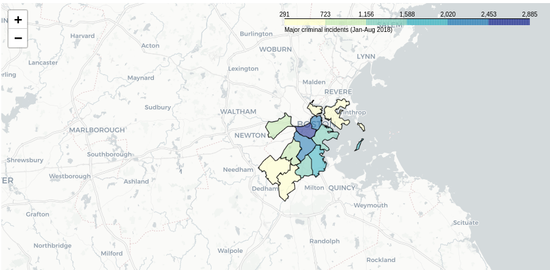

# Portfolio Template

### A beautiful minimal and accessible portfolio template for Developers ✨.

To View the live site click [here &rarr;](https://excellent-story.surge.sh)

<!--  -->


## Features

- Clean, Simple and Modern UI Design.
- Uses No CSS or JavaScript Frameworks or libraries as dependencies.
- Built with only HTML, CSS and a bit of JavaScript 🔨.
- Well Organized Documentation.
- Keyboard support.
- Fully Responsive.
- Loads fast ⚡.

### Header

In all of the places where you're supposed to fill your information you'll find HTML comments. As shown below just replace what is already in the opening and closing tags below the comment with your information.

```html
<div class="header__text-box row">
    <div class="header__text">
        <h1 class="heading-primary">
        <!-- Replace the following name with your name -->
        <span>Robert Judal Regalado</span>
        </h1>
        <!-- Put a small paragraph about yourself -->
        <p>A Web Developer based in Cavite, Philippines.</p>
        <a href="#contact" class="btn btn--pink">Get in touch</a>
    </div>
</div>
```

### Work Section

Each div with class `work__box` represents a project, replace the contents of the all the tags with the information of your projects.

```html
<div class="work__box">
    <div class="work__text">
    <h3>Boston Crime Map: Insights and Analysis</h3>
    <p>
        Boston Crime Map: Insights and Analysis" is a project focused on analyzing and visualizing crime data in Boston. Using geographical data and crime statistics, the project aims to provide insights into crime patterns and trends in the city. Through interactive maps and data visualization techniques, users can explore various aspects of crime incidents, such as types of crimes, locations, and time distributions. The project may uncover patterns that could help law enforcement agencies, policymakers, and residents better understand and address crime-related issues in Boston.
    </p>
    <ul class="work__list">
        <li>Python</li>
        <li>Folium</li>
        <li>Pandas</li>
        <li>Geopandas</li>
    </ul>

    <div class="work__links">
        <a href="#" class="link__text">
        Visit Site <span>&rarr;</span>
        </a> 
        <a href="#" target="_blank">
        
        </a>
    </div>
    </div>
    <div class="work__image-box">
        
    </div>
</div>
```

For changing the screenshot:
- first place the image in `images/` folder and then in HTML replace the name in `src` with the name of your image.

- Recommended size for project image (1366 x 767px) also make sure the size of all  project images is the same.

```html

```

### Clients Section

- Place the logos of the clients and companies that you have worked with in `images/` directory and then replace the name in `src` with the name of your logos accordingly.

- Make sure that you don't have whitespace on either side of the logos.

```html

```

### About Section

- Replace the contents in the below paragraph with information about yourself.
- Place a nice photo of yourself in the `images/` directory and then change the name in the src with your image name.

```html
<section class="about" id="about">
    <div class="row">
        <h2>About Me</h2>
        <div class="about__content">
            <div class="about__text">
                <!-- Replace the below paragraph with info about yourself -->
                <p>
                    I'm Robert, a dedicated Python developer passionate about crafting efficient and scalable applications. With a solid background in computer science and extensive hands-on experience, I specialize in building robust backend systems, data analysis tools, and automation scripts using Python.
                </p>
                <!-- Provide a link to your resume -->
                <a href="mailto:rjregalado1979@gmail.com" class="btn">Contact Me</a>
            </div>

        <div class="about__photo-container">
        <!-- Add a nice photo of yourself -->
        
    </div>
</div>

    </div>
</section>
```

### Contact Section

- Modify the paragraph to your likings.
- Replace the email with yours in the `href` anchor property and the text also.

```html
<section class="contact" id="contact">
      <div class="row">
        <h2>Get in Touch</h2>
        <div class="contact__info">
          <p>
            Are you looking for a fast-performing and user-friendly website to
            represent your product or business? or looking for any kind of
            consultation? or want to ask questions? or have some advice for me
            or just want to say "Hi 👋" in any case feel free to Let me know. I
            will do my best to respond back. 😊 The quickest way to reach out to
            me is via an email.
          </p>
          <!-- Replace the email with yours -->
          <a href="rjregalado1979@gmail.com" class="btn">rjregalado1979@gmail.com</a>
        </div>
      </div>
</section>
```

### Footer

- Replace the `href` attribute values to your profile URLs for all anchors.
- Remove the div with class `footer__github-buttons`.

```html
<footer role="contentinfo" class="footer">
    <div class="row">
        <!-- Update the links to point to your accounts -->
        <ul class="footer__social-links">
            <li class="footer__social-link-item">
                <a href="#">
                    
                </a>
            </li>
            <li class="footer__social-link-item">
                <a href="https://github.com/robertregalado/">
                    
                </a>
            </li>
            <li class="footer__social-link-item">
                <a href="#">
                    
                </a>
            </li>
            <li class="footer__social-link-item">
                <a href="https://www.linkedin.com/in/robert-regalado-20014a15/">
                    
                </a>
            </li>
        </ul>

        <!-- If you give me some credit by keeping the below paragraph, will be huge for me 😊 Thanks. -->
        <p>
          &copy; 2024 - Template designed & developed by ROJRE</a>.
        </p>
<!--         <div class="footer__github-buttons">
          <iframe
            src="https://ghbtns.com/github-btn.html?user=nisarhassan12&repo=portfolio-template&type=watch&count=true" 
            frameborder="0" scrolling="0" width="170" height="20" title="Watch Portfolio Template on GitHub">
          </iframe>
        </div> -->
    </div>
</footer>
```
